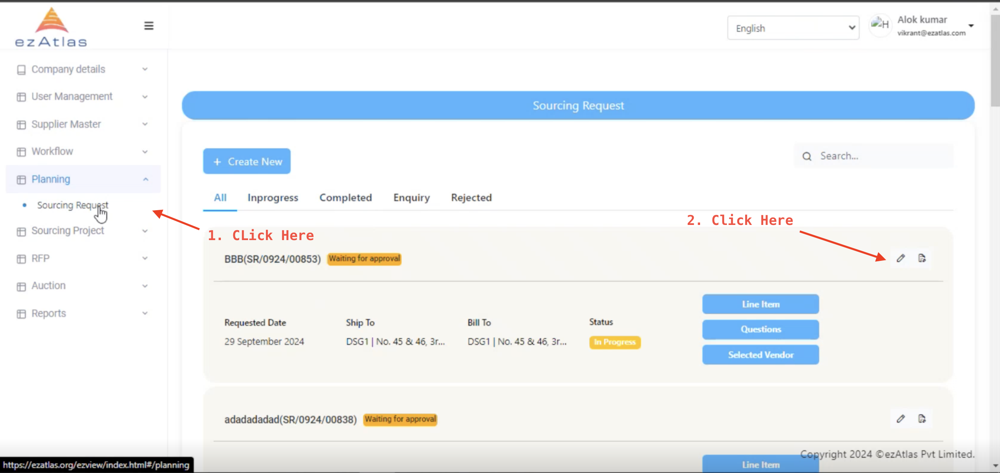
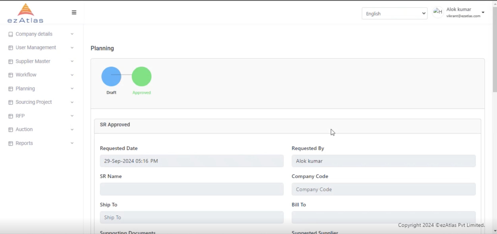
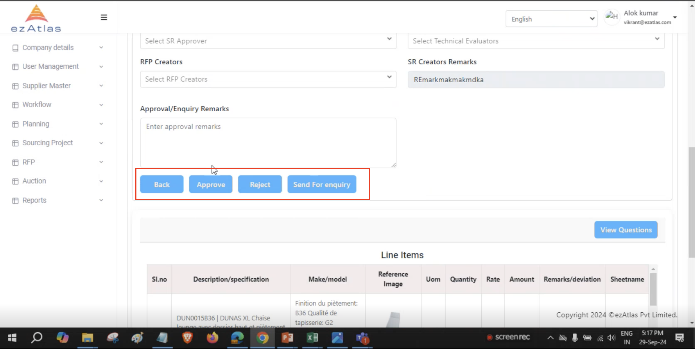

# **How to approve a SR request**

The SR approvar will get an approval request and can see it in the sidebar's Planning-> Sourcing Request 

To accept the SR the approvar need the click on the edit button you can vierify the details before approving it 

One will get option to send it for enquiry or to see the questions as well as to approve it and take it to next step 

**Upon Approval it will go for Sourcing Project**

