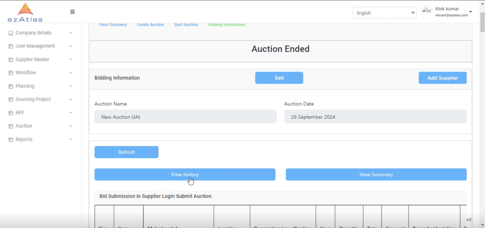
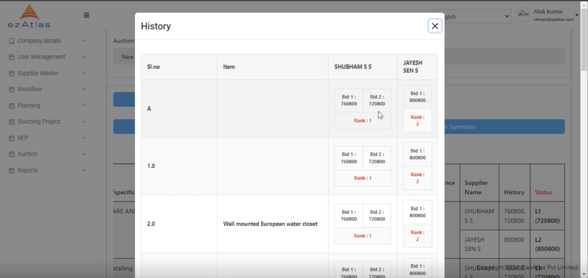
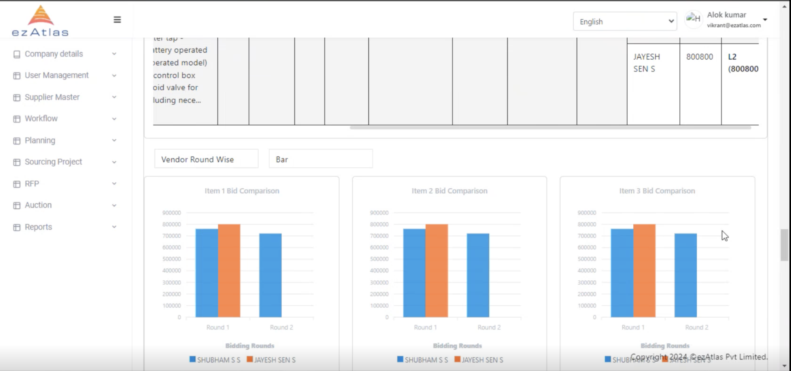
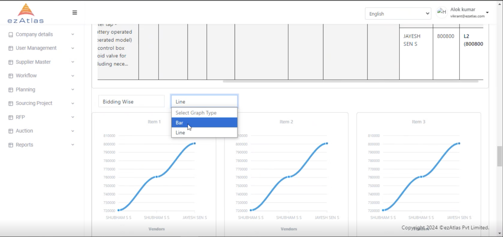

# Bidding Process 

After Price discovery we will Create & Start the Auction

#### We can check the History of the Bid

#### The Data is represented in graph for easy understanding

#### And the graph can be represented in many forms

