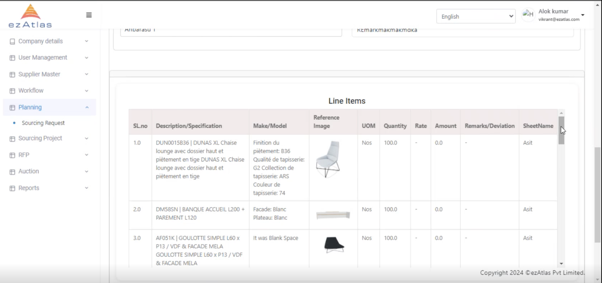
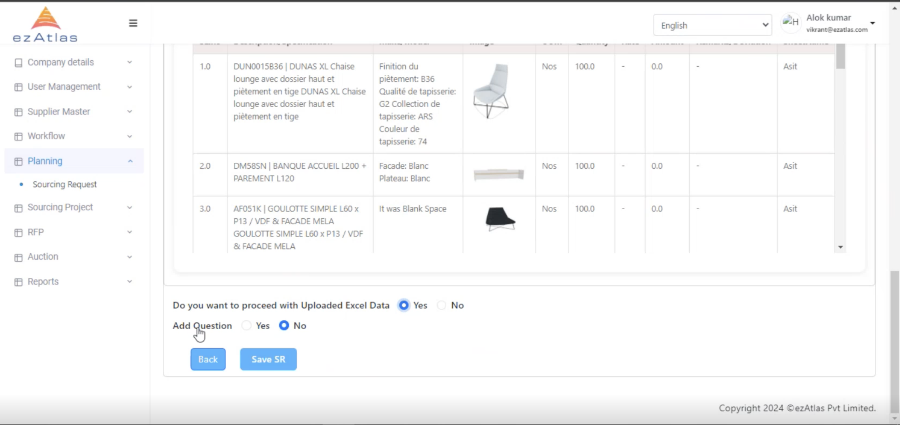

# **How to add Line Items**

There are two ways to add Line Items 

- Add Manually
- Add Using Excel

## Add Using Excel

We can upload the excel to add the line items 

**Note:** it should be in the specified format mentioned in the picture.

## Save SR

Then we can add questions and save the SR

**Once SR is launched the approver is notified**

