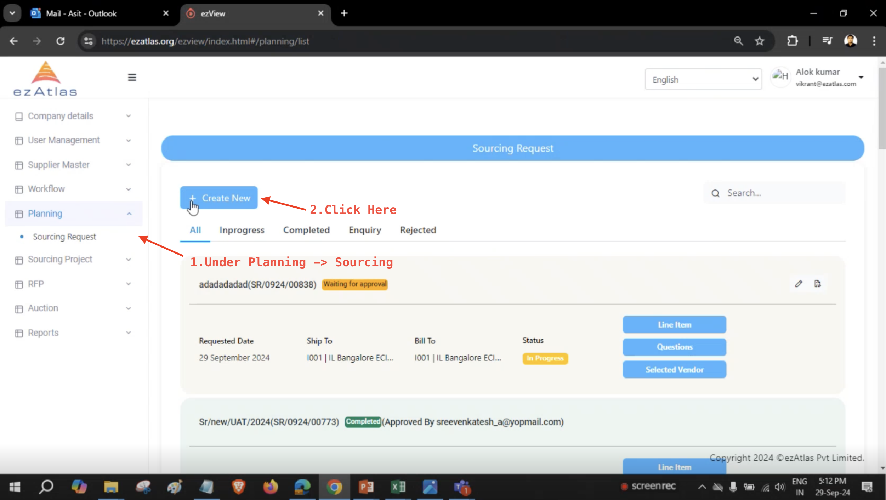
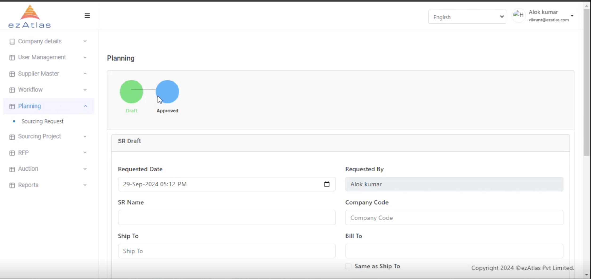
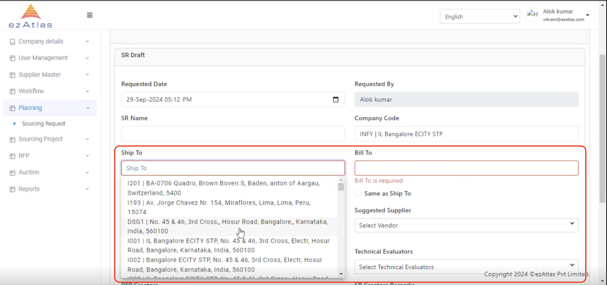
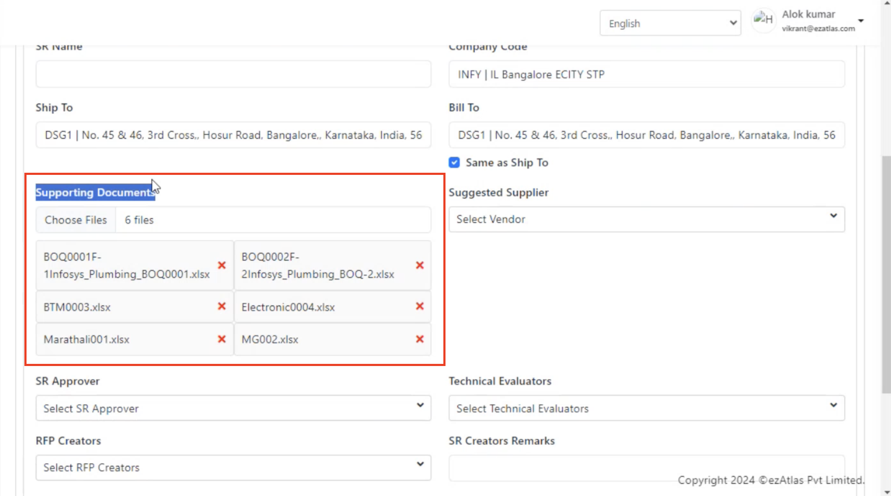
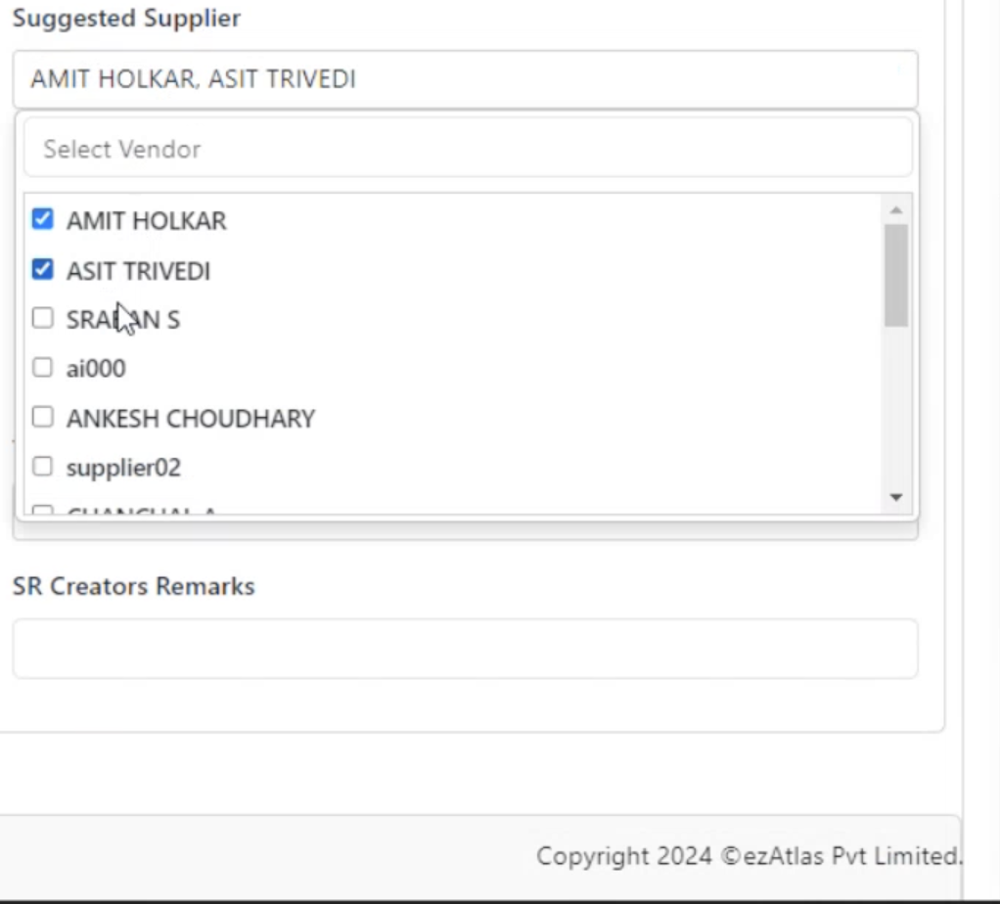
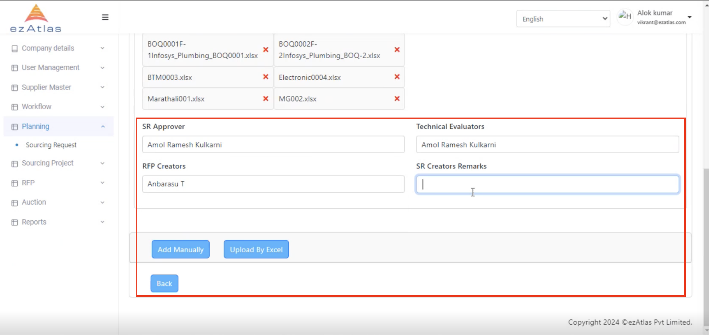

# **Create New SR**

## **Step 1 : Create new SR Request**

CLick Planning -> Sourcing Request -> Create New as shown in below picture

## **Step 2: We can now create new SR Request**

 We can create new SR Request by filling up the form

#### Step 2.1 : Address selection

We can add address by selecting the address mapped to theselected company or we can type out custom address as per our requirement.

#### Step 2.3 : Document Selection 

We can add supporting document by selecting relevant files required 

#### Step 2.4 : Supplier Selection

We can choose the suggested supplier from drop down

#### Step 2.5 : Assignemnt of Approvars and Evaluators

Finally we can complete the form by assigning relavant SR Approvar, Technical Evaluators, RFP creator and remarks

#### We can continue our understanding of how to add Line items in the following pages

