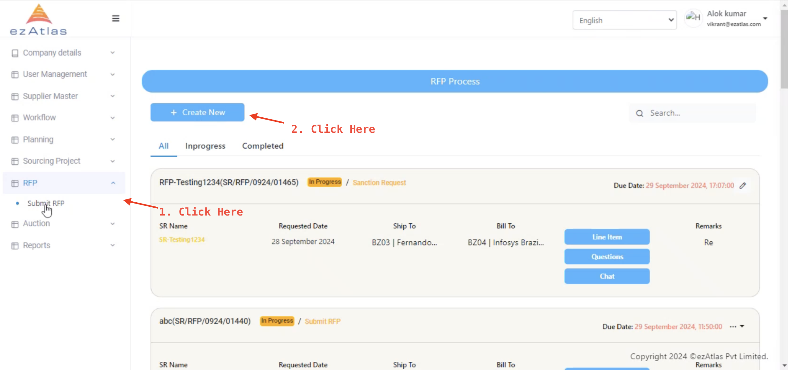
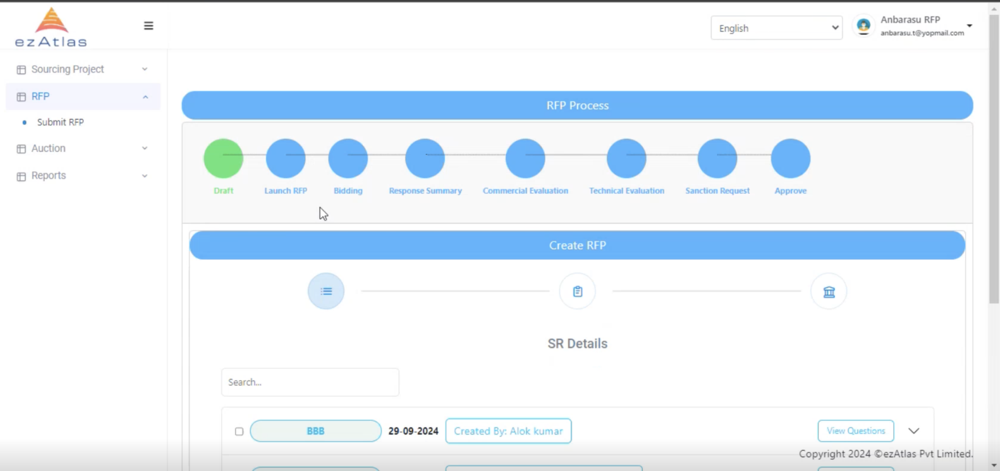
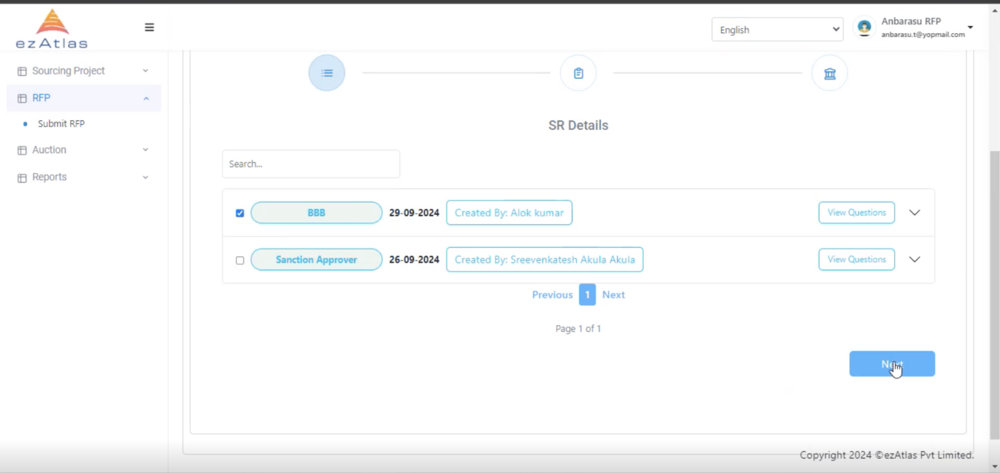
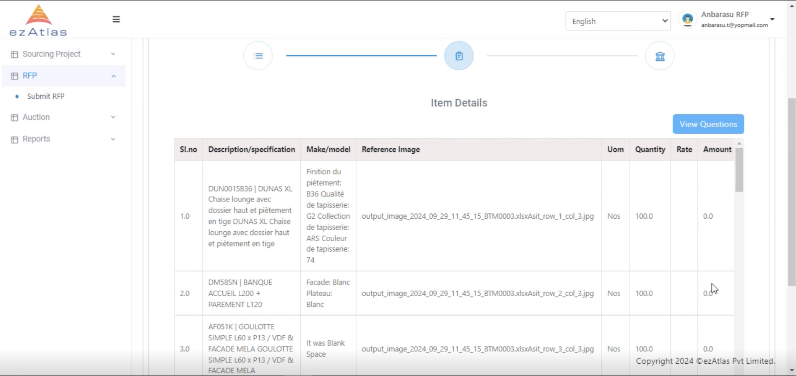
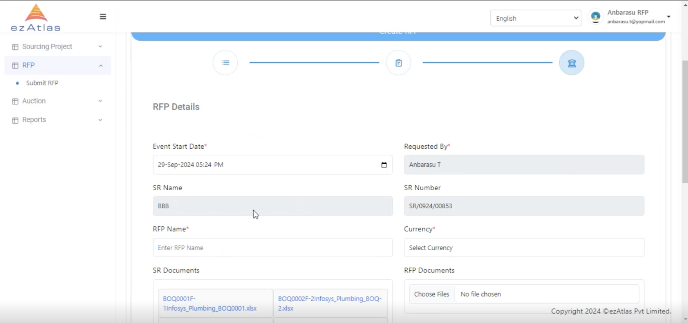
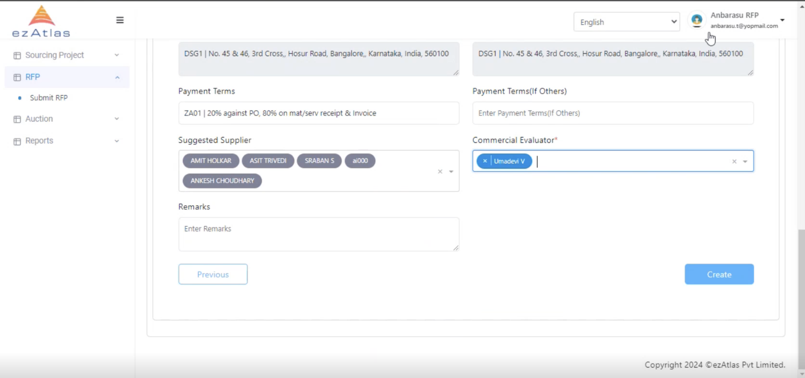

# **Request for Proposal**

For every neew RFP new request need to be created from buyer side

## **Step 1 : Create new RFP**

First Select Submit RFP from sidebar

as we can the page to see the RFP Process and Create new RFP page 

## **Step 2: Selection of SR**

Upon selection of the RFP we can continue the process to create new RFP

**Note: Only 1 SR can be chosed to create new RFP**

## **Step 3: Confirm the item details**

## **Step 4: Fill the RFP details**

## Submit new RFP Request

by adding payment terms, Commercial evaluator and remarks we can submit our RFP details

