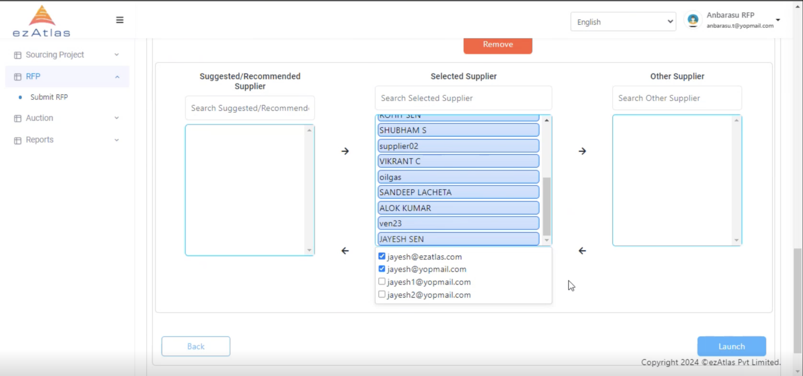

# Launch of RFP

## Step 1 : Opening and Closing Date for RFP

Here we set the the opeing and closing date for RFP with remarks and add other Supplier details

## Step 2 : Supplier Selection

Here we select the supplier for RFP and we can choose among suggested supplier or we can also add other supplier 

With Supplier selection we can also select there email and upon selection we can launch our RFP.

