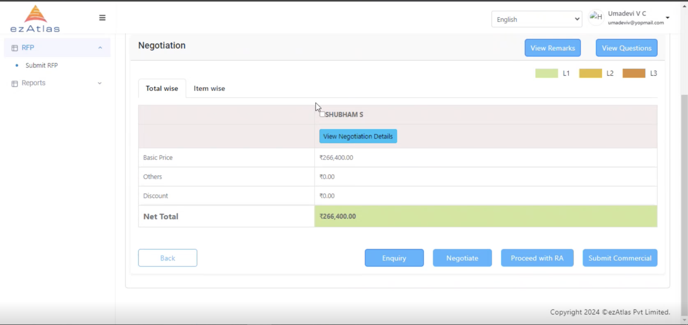
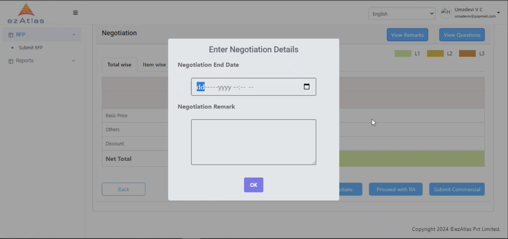
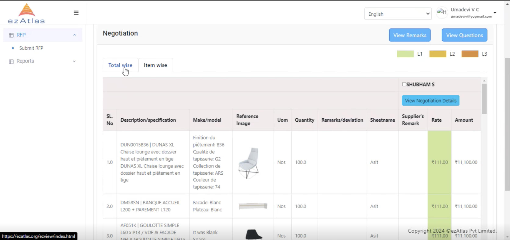
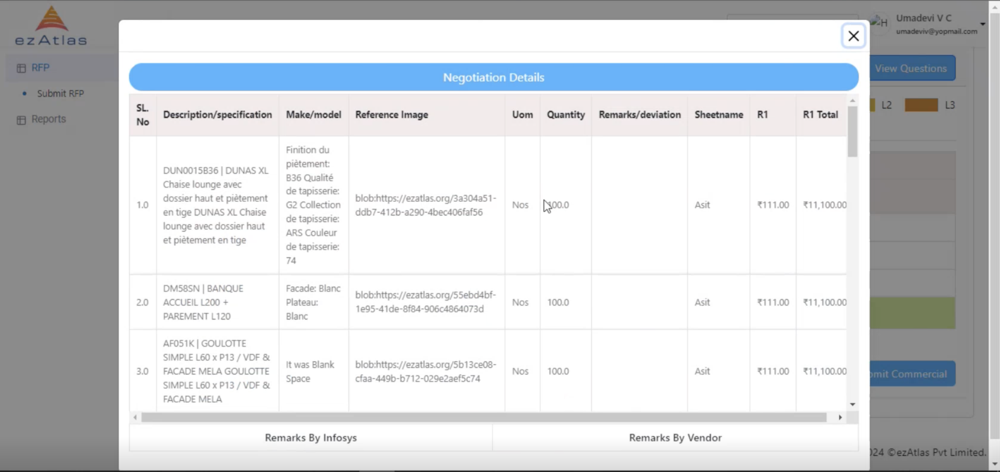
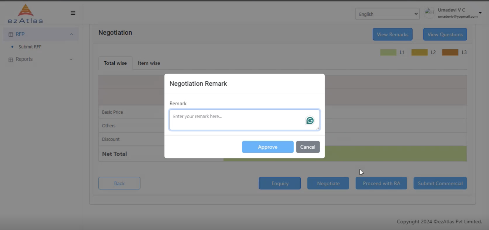

# **Commercial Evaluation**

Selected commercial evaluator will get to evaluate the RFP

[You can follow this step for opening RFP Req for the Evaluator](/Request%20For%20Proposal/commercialevaluation/#step-1-for-commercial-evaluator)

## **Step 1 : For Commercial Evaluator**
`

## **Role of Evaluator**

The evaluator can view remarks or question, select the supplier and see a summary of RFP with also having the choice to proceed with Commercial or proceed with Reverse Auction

The Evaluator can also initiate negotiations with supplier which supplier can also respond to 

Evaluator can also see item wise details of the RFP

ALso the Evaluator can see the Negotiation details for the same

## **Remarks**

At the end the evaluator can submit the commercial for by giving a Remark

## Post Evaluation 

Buyer can either skip the technical discussion and directly go to Sanction Request or the technical discusion will be evaluated bu the selected Technical Evaluator

