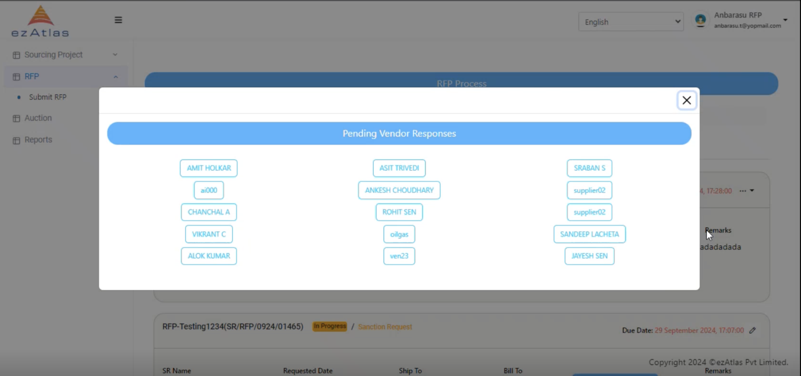
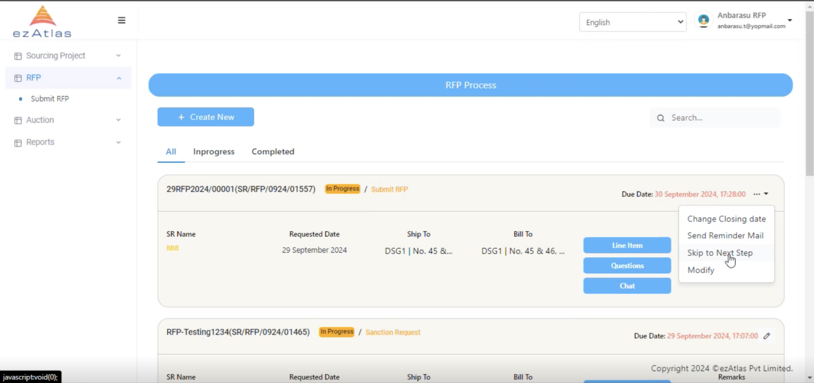
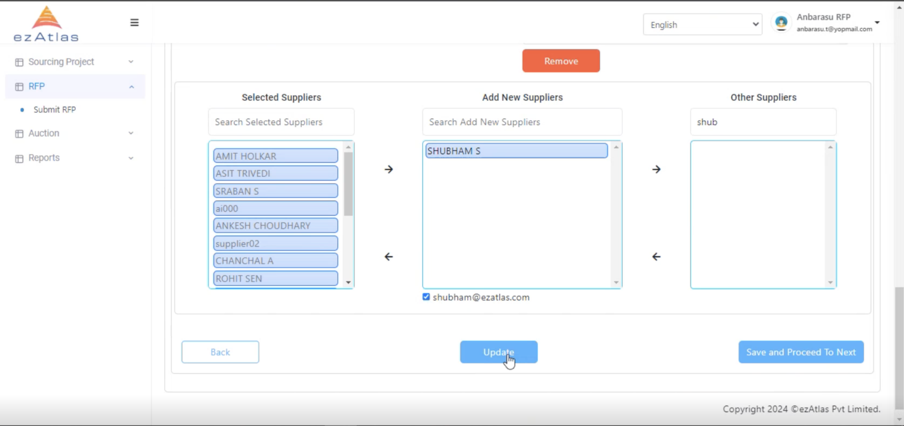
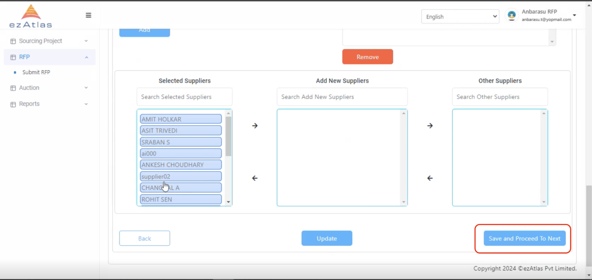

# **Modification of RFP**

After Launching RFP we can also modify existing RFP for eg. We can add new Supplier also we can **send reminder mails to selected supplier** 

## **Step 1**

## **Step 2: Select the new Supplier**

after selection of new supplier we can **update it** 

## **Note:**

**After clicking on Save and continue we will proceed to next step and cannot edit the RFQ anymore**

