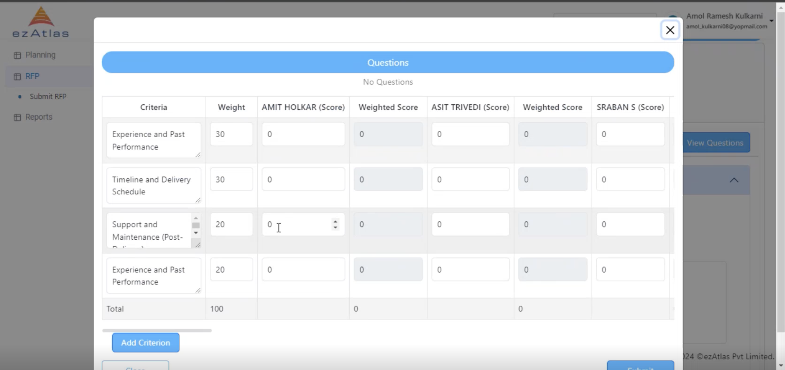

# **Technical Evaluation**

The Selected Technical Evaluator evaluates the technical questions and can enquire supplier if required

[You can follow this step for opening RFP Req for the Evaluator](/Request%20For%20Proposal/commercialevaluation/#step-1-for-commercial-evaluator)

## **Evaluate Questions**

Based on the Question Evaluater evalues it with scores

## **Remarks**

Upon Successful Evaluation Technical Evaluator can proceed with leaving the remark

The Evaluations can be examined by the Buyer in **Response Summary** and can proceed with Sanction Request