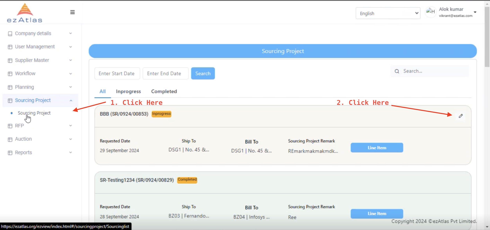
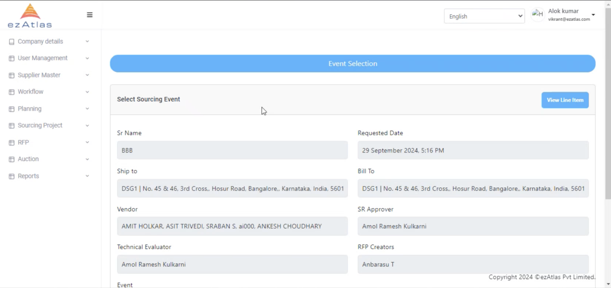
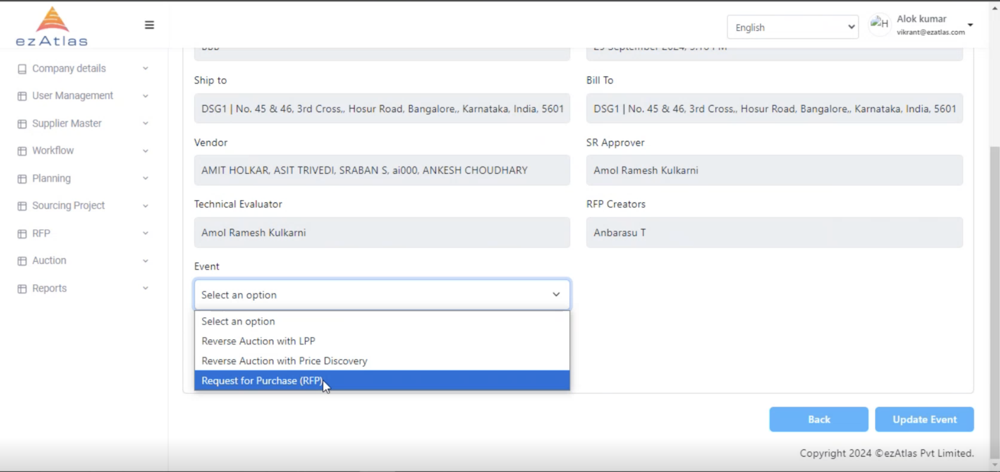
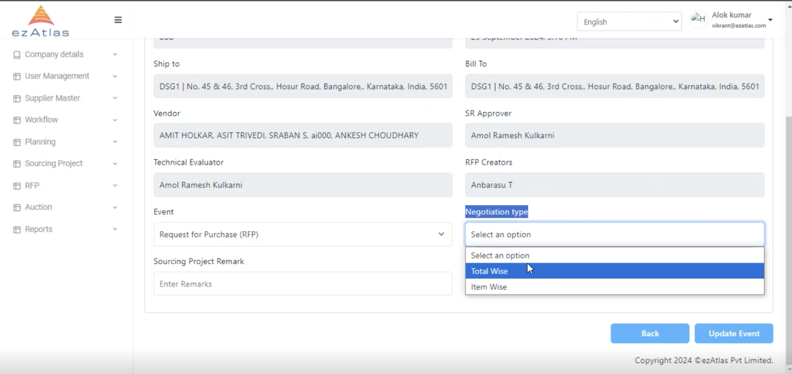

# **Sourcing Event**

Here the organization selects if they want to go for Reverse Auction or RFP

## **Step 1: View the Sourcing Project**

one can view line item here as well as choose the sourcing event.

## **Step 2: Choose the Sourcing Event**

After choosing Sourcing event (in this case RFP) one has to choose negotiation wise

## **Step 3: Choose the Negotiation Type**

We can add negotiation type total wide or item wise and after adding remark we can update the event

**From here the buyer role is starting and RFP (Request for Proposal) process will start**

