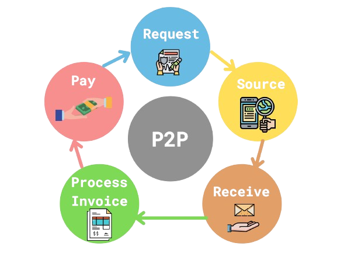
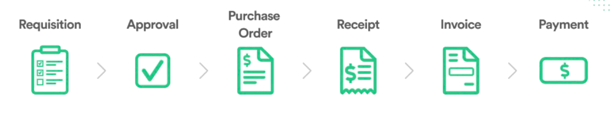

# **Introduction**

Welcome to P2P ERP Software User Manual

## **Sections**
- [Getting Started](getting-started/introduction.md)
- [User Guide](user-guide/overview.md)
- [API Reference](api/api-overview.md)

## **What is P2P ERP software?**

The P2P ERP software is a comprehensive and integrated enterprise resource planning system designed to streamline and automate various business processes for procurement, inventory management, and financial operations. This user manual is intended to provide a detailed guide for users to effectively utilize the software's features and functionalities to achieve optimal results.

This user manual is organized into sections and chapters that provide a logical flow of information. Each chapter includes step-by-step instructions, screenshots, and examples to facilitate easy understanding of the software's features and functionalities. Users can navigate through the manual using the table of contents or the index.

## **About**

P2P ERP software is a cutting-edge solution that enables organizations to manage their procurement-to-pay (P2P) cycle efficiently, reducing costs, and improving overall business performance. The software is designed to cater to the needs of various industries, including manufacturing, retail, and services. With its modular architecture, P2P ERP software offers a flexible and scalable solution that can be easily integrated with existing systems.

## **Purpose**

This user manual is designed to provide a comprehensive guide for users to understand the features, functionalities, and best practices for using P2P ERP software. The manual covers various aspects of the software, including system navigation, module overviews, transaction processing, reporting, and troubleshooting. The goal of this manual is to empower users with the knowledge and skills necessary to maximize the benefits of P2P ERP software and achieve operational excellence.

## **Target Audience**

This user manual is intended for users who will be working with P2P ERP software, including: 

1. Procurement professionals 

2. Inventory managers 

3. Financial analysts 

4. System administrators 

